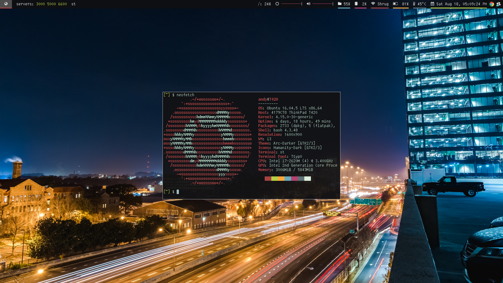

# Wandy's dots

This repo contains my dotfiles for environment (inputrc Xdefaults etc...) tools (vim tmux etc...) window manager (i3-gaps) and bash scripts

## bin/dots

  USAGE:

    dots: dotfile repo manager

     dots [ -n ] add

     dots -n         : send notification

     dots add .vimrc : add .vimrc to dots repo

  OPTIONS:

     -n : send notification to commit dotfiles

  COMMANDS:

     add : add file to dots repo

